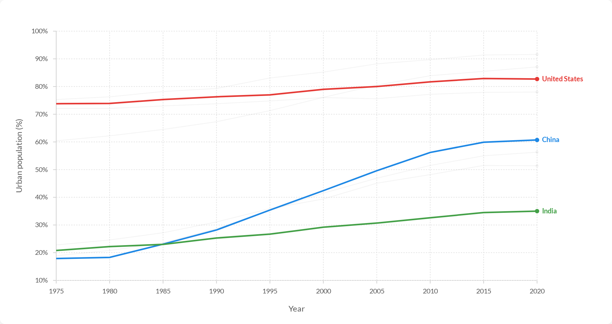
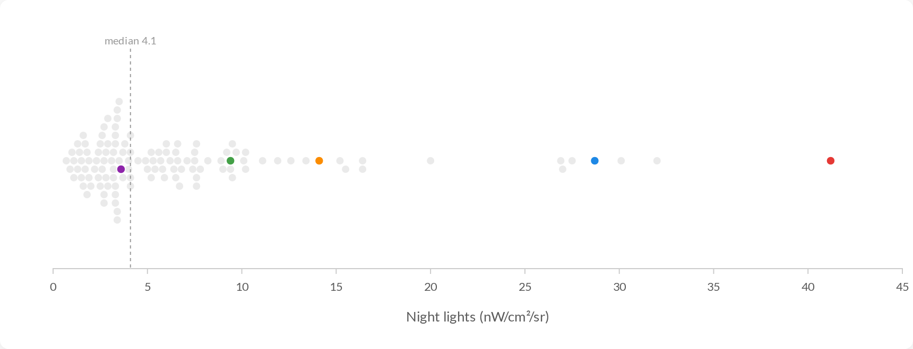

# @devdatalab/ddl-charts

D3-based charting library for publication-quality, OWID-inspired interactive data visualizations.

## Installation

```bash
npm install @devdatalab/ddl-charts
```

## Usage

```javascript
import { TrajectoryChart } from '@devdatalab/ddl-charts';
// The stylesheet is not auto-imported — include it once in your app:
import '@devdatalab/ddl-charts/styles/ddl-theme.css';

const chart = createLineChart(d3.select('#chart'), data, {
  initialHighlights: ['USA', 'CHN', 'IND'],
  showLegend: true,
  showLabels: true,
});
```

The library ships three charts — see the [Charts catalogue](#charts-catalogue)
below: a multi-series **LineChart**, a single-track **BeeswarmChart**, and the
**TrajectoryChart**.

## Architecture

```
src/
├── core/           # Foundation utilities
│   ├── scales.js   # D3 scale factories (log, linear, time)
│   ├── axes.js     # OWID-styled axis generators
│   ├── colors.js   # Color palettes, country/region highlighting
│   ├── utils.js    # Formatting, data processing, debounce
│   └── layout.js   # Label de-collision, beeswarm packing, nearest-point
├── components/     # Reusable UI elements
│   ├── Tooltip.js  # Smart-positioned hover tooltips
│   ├── Legend.js   # Interactive legend with state
│   ├── SearchFilter.js  # Search input with filtering
│   └── Container.js     # Responsive SVG containers
├── charts/         # Chart implementations
│   ├── LineChart.js        # Multi-series interactive line chart
│   ├── BeeswarmChart.js    # Single-track 1D beeswarm (dot strip)
│   └── TrajectoryChart.js  # GDP vs PM2.5 trajectory visualization
└── styles/
    └── ddl-theme.css  # DDL / OWID-inspired theming
```

## Core Modules

### Scales (`core/scales.js`)
- `createLogScale(domain, range, options)` - Logarithmic scales for GDP, population
- `createLinearScale(domain, range, options)` - Linear scales with padding
- `createTimeScale(domain, range, options)` - Temporal scales

### Axes (`core/axes.js`)
- `createXAxis(scale, options)` - Horizontal axis with grid lines
- `createYAxis(scale, options)` - Vertical axis with grid lines

### Colors (`core/colors.js`)
- `createColorManager(highlights)` - Dynamic country highlighting
- `createRegionColorManager()` - Region-based color assignment
- Built-in palettes: `PRIMARY_COLORS`, `CONTINENT_COLORS`, `REGION_COLORS`,
  `HIGHLIGHT_COLORS` (default categorical), `OKABE_ITO` (colorblind-safe
  categorical; opt in via a chart's `palette` option)

### Utilities (`core/utils.js`)
- `formatNumber(n, precision?)` - Compact SI notation (`45K`, `2B`); integer results omit decimals, others use `precision` (default 2, so `1500000` → `1.50M`)
- `formatPercentage(n, decimals?)` - Percentage with trailing `%` (`45%`, `4.5%`)
- `formatLocaleNumber(n)` - Full value with thousands separators (`1,234,567`)
- `formatCurrency(n)` - Dollar formatting
- `formatPM25(n)` - µg/m³ formatting
- `smoothValues(arr, window)` - Rolling average

> **Behavior change (unreleased):** `formatNumber` now prints whole-number SI
> results without trailing zeros — `formatNumber(45000)` returns `"45K"` instead
> of `"45.00K"`. Non-integer results are unchanged. Warrants a version bump
> before any release that consumers depend on.

### Layout (`core/layout.js`)
- `resolveCollisions(positions, minGap)` - Space out crowded label Y positions
- `beeswarmLayout(values, xScale, dotRadius, centerY, rowSpacing?)` - Deterministic 1D beeswarm packing (O(n²); fine for n ≤ 250)
- `nearestPoint(points, mouseX, mouseY, snapRadius)` - Nearest-point hit testing for hover (linear scan)

## Components

### Tooltip
```javascript
import { createTooltip, showTooltip, hideTooltip } from '@devdatalab/ddl-charts';

const tooltip = createTooltip(container);
showTooltip(tooltip, x, y, content);
```

### Legend
```javascript
import { createLegend } from '@devdatalab/ddl-charts';

const legend = createLegend(container, items, {
  onItemClick: (item) => console.log('clicked', item),
  onItemHover: (item) => console.log('hovered', item)
});
```

### SearchFilter
```javascript
import { createSearchFilter } from '@devdatalab/ddl-charts';

const search = createSearchFilter(container, {
  placeholder: 'Search cities...',
  onFilter: (query) => filterData(query)
});
```

## Charts catalogue

Every chart is an imperative factory — `create*(parent, data, options)` — that
builds the DOM with D3 and returns an instance object with update methods.
`parent` is a `d3.Selection` (e.g. `d3.select('#chart')`).

### LineChart

Multi-series interactive line chart. Highlighted series are drawn in full
colour, raised, and labelled at the line end (de-collided via
`resolveCollisions`); the rest are muted. Hover snaps to the nearest series
point for a marker + tooltip. A single-series chart is just the N=1 case
(`showLegend: false`, `showLabels: false`).



```javascript
import * as d3 from 'd3';
import { createLineChart } from '@devdatalab/ddl-charts';

const chart = createLineChart(d3.select('#chart'), data, {
  height: 480,
  initialHighlights: ['USA', 'CHN', 'IND'],
  showLegend: true,
  showLabels: true,
  curve: 'linear',            // 'linear' | 'cardinal'
  yTickFormat: (d) => `${d}%`,
});

chart.toggleHighlight('BRA'); // programmatic highlight toggle
```

**Data format**

```json
{
  "metadata": { "title": "...", "xAxisLabel": "Year", "yAxisLabel": "Urban population (%)" },
  "series": [
    {
      "id": "USA",
      "name": "United States",
      "points": [
        { "year": 1975, "value": 73.7 },
        { "year": 2020, "value": 82.7 }
      ]
    }
  ]
}
```

**Options**

| Option | Default | Description |
| --- | --- | --- |
| `height` | `500` | Chart height in px. |
| `margin` | `{top:30,right:140,bottom:50,left:70}` | Chart margins. |
| `xKey` / `yKey` | `'year'` / `'value'` | Accessor keys on each point. |
| `showLegend` | `true` | Clickable legend (toggles highlights). |
| `showLabels` | `true` | De-collided end-of-line labels for highlighted series. |
| `showGrid` | `true` | Axis grid lines. |
| `initialHighlights` | first 3 series | Series ids highlighted on load. |
| `palette` | `HIGHLIGHT_COLORS` | Categorical palette for highlighted series. |
| `yZeroBaseline` | `false` | Force the y-domain to start at 0. |
| `curve` | `'linear'` | Line interpolation (`'linear'` or `'cardinal'`). |
| `hoverSnapRadius` | `40` | Max px distance for hover snapping. |
| `xTickFormat` / `yTickFormat` | — | Custom tick formatters. |

Returns `{ container, svg, colorManager, toggleHighlight, updateAll }`.

See [`examples/line_chart.html`](examples/line_chart.html).

### BeeswarmChart

Single horizontal track that packs one value per entity into stacked rows
(`beeswarmLayout`, O(n²), fine for n ≤ 250). A handful of entities can be
highlighted (coloured + raised); the rest render as muted background dots.
Optional median reference line; hover snaps to the nearest dot for a tooltip.
Compose multi-track figures by stacking several instances.



```javascript
import * as d3 from 'd3';
import { createBeeswarmChart } from '@devdatalab/ddl-charts';

const chart = createBeeswarmChart(d3.select('#chart'), data, {
  height: 290,
  dotRadius: 3.5,
  rowSpacing: 8,
  highlights: ['USA', 'CHN', 'IND', 'BRA', 'NGA'],
  showMedian: true,
});

chart.setHighlights(['USA', 'IND']); // replace the highlighted set
```

**Data format**

```json
{
  "metadata": { "title": "...", "axisLabel": "Night lights (nW/cm²/sr)" },
  "items": [
    { "id": "USA", "name": "United States", "value": 41.2 }
  ]
}
```

**Options**

| Option | Default | Description |
| --- | --- | --- |
| `height` | `240` | Chart height in px. |
| `margin` | `{top:30,right:30,bottom:56,left:30}` | Chart margins. |
| `valueKey` / `idKey` / `nameKey` | `'value'` / `'id'` / `'name'` | Accessor keys on each item. |
| `label` | `metadata.axisLabel` | Axis label. |
| `dotRadius` | `3` | Dot radius in px. |
| `rowSpacing` | `dotRadius * 2.2` | Vertical row spacing (passed to `beeswarmLayout`). |
| `highlights` | `[]` | Ids to highlight. |
| `showMedian` | `true` | Draw a median reference line. |
| `hoverSnapRadius` | `13` | Max px distance for hover snapping. |
| `palette` | `HIGHLIGHT_COLORS` | Categorical palette for highlights. |
| `valueFormat` / `tickFormat` | — | Custom value / tick formatters. |

Non-finite values are filtered (with a `console.warn`) before layout. Returns
`{ container, svg, setHighlights, update }`.

See [`examples/beeswarm.html`](examples/beeswarm.html).

### TrajectoryChart

The original chart implementation showing city GDP vs PM2.5 trajectories over
time, with country/region highlighting, search, and an interactive legend.

```javascript
import * as d3 from 'd3';
import { createTrajectoryChart } from '@devdatalab/ddl-charts';

const chart = createTrajectoryChart(d3.select('#chart'), data, {
  initialHighlights: ['CHN', 'IND', 'USA'],
  showSearch: true,
  showLegend: true,
  showLegendControls: true,
  showGrid: true
});
```

#### Data Format

```json
{
  "metadata": {
    "title": "City GDP vs PM2.5",
    "xAxisLabel": "GDP per capita (USD)",
    "yAxisLabel": "PM2.5 (µg/m³)",
    "yearRange": [2013, 2023]
  },
  "bounds": {
    "xMin": 100, "xMax": 100000,
    "yMin": 1, "yMax": 200
  },
  "cities": [
    {
      "id": "IND_Mumbai",
      "name": "Mumbai",
      "country": "India",
      "iso3": "IND",
      "region": "South Asia",
      "trajectory": [
        { "year": 2013, "x": 5000, "y": 45 },
        { "year": 2023, "x": 8000, "y": 35 }
      ]
    }
  ]
}
```

## Development

```bash
npm install
npm run dev      # Start dev server
npm test         # Run tests
npm run build    # Build for production
```

### Regenerating README visuals

The chart screenshots in this README are rendered headlessly from the example
HTML so they stay reproducible:

```bash
npm install --no-save playwright   # heavy, build-time only — not a runtime dep
npx playwright install chromium    # one-time browser download
npm run render:examples            # writes docs/assets/*.png
```

## Examples

The example HTML files import the library source directly (an import map
resolves `d3` to a CDN ESM build), so they run on any static server or via
`npm run dev`:

- [`examples/line_chart.html`](examples/line_chart.html) — multi-series LineChart.
- [`examples/beeswarm.html`](examples/beeswarm.html) — single-track BeeswarmChart.
- [`examples/city_gdp_pm25.html`](examples/city_gdp_pm25.html) — TrajectoryChart with 205+ cities.

## License

MIT
